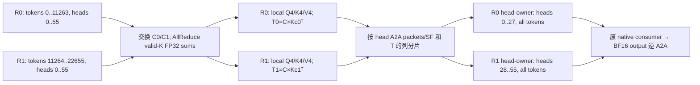

# N1：FP4 通信边界上的 query-center 校正依赖

2026-10-03；只读源码与既有结果，一次定向重读 LongLive-2.0 官方论文；无 GPU、安装或新 kernel。

**结论：原 BF16 Ulysses ownership 已使校正完全本地，不会被迫多传一份 BF16 K。若明确要求在 token-owner 上先打包 FP4、head-owner 仍消费原 BF16-K 校正，则有真实的信息与同步依赖；但传 BF16 K 不是唯一解。交换小中心后在 K-owner 生成 T 的列分片，是普通分布式 matmul 重排。E034 的16个连续中心使这条方案具有可量的载荷差异，值得一次同合同两卡边界测量；尚非方法贡献，也没有已测通信瓶颈。**

## 已有路径究竟在哪里做中心化

| 读到的实际来源 | Q 中心／校正与 ownership |
|---|---|
| 本机 FlashInfer 0.7.0.post1 | `per_block_mean=True` 为 padded Q 每128行中心，False 为 padded Q 全局中心；两者先将 valid K 减全序列 BF16 均值。`T=C.float()@Kc.float().T` 为 FP32，consumer 广播相应行。API 本身无 collective，调用方决定位置。[preprocess](/data1/models/svdquant-wjq/research/envs/nvfp4-native-20261002/lib/python3.12/site-packages/flashinfer/nvfp4_attention_sm120.py:123) |
| 固定 FastVideo `8444c089` 的 Ulysses | QKV head-scatter/sequence-gather **先于** backend preprocess/attention；owner 已持有全序列、部分 heads 的 BF16 QKV。因此普通 Sage3 或 FlashInfer 放在这里无需远端 T。它的可选 RoPE 也在 A2A 后，不能笼统称所有现成实现都在 post-RoPE 后通信。[layer:148](/data1/models/svdquant-wjq/third_party/FastVideo-8444c089/fastvideo/attention/layer.py:148) |
| SageAttention 来源需区分 | 本机旧 Sage1 INT8 只减 K 序列均值，无 Q 中心。已缓存官方 Sage3 `api.py:75–91,131` 默认 block-Q，也可 global-Q；BF16 matmul 后转 FP32 的 T **不等同** FlashInfer 两输入先转 FP32。E024 实际 FastWan 修改版默认 Q/K smoothing **均 False**，传零 T；`per_block_mean=True` 标签不代表实际启用了中心化。[已执行 FastWan API](/data1/models/svdquant-wjq/third_party/FastVideo-8444c089/fastvideo-kernel/attn_qat_infer/api.py:85) |
| 本地 xDiT 接入／当前 upstream 的边界 | 本地 DiffSynth adapter 在投影→norm→RoPE 后交 `xFuserLongContextAttention(AttnType.FA)`，没有 Q-center/T。[实际入口](/home/wjq/workspace/DiffSynth-Studio/diffsynth/utils/xfuser/xdit_context_parallel.py:154)。旧文献笔记核过 upstream NVFP4/FP8 通信选项，但未保存其当前完整 consumer 源，本轮不推断该选项使用哪种 Q 中心或在哪里产生 T。 |
| LongLive-2.0 §3.2 / Appendix D | 已明确把运行时 Q 和压缩 KV 在低位空间 All-to-All，并有 H100 SP 测量；其 K-smoothing 式(6)沿 head channel，非本机 FlashInfer 序列 K 均值。所读论文未规定 block/global Q 中心或本机 T 合同，也未证明 A2A 后直接消费同一份 native FP4 attention packet。因此“已有低位通信”成立，“已解决同一高精度 correction 合同”尚不能据此断言。[官方论文](https://arxiv.org/html/2605.18739v2#A4) |

## P=2 的具体依赖与账本

固定现有 H3 输入 `H=56,D=128,Nvalid=22539,Npad=22656,G=177`。虚拟 token-owner R0 拥有 `[0,11264)`、R1 拥有 `[11264,22656)`；两卡最初各有全部56 heads，A2A 后分别拥有28 heads 的全序列。最后117行是原官方 Q/V padding；K 先按22539 valid 行统计／去均值，再补零。E034 coarse 边界 `floor(j*177/16)` 的第8项正好88，所以此切分下每卡独立得到8个完整 coarse BF16 中心，最后一个中心的1536行分母仍含117个零。

这里没有“attention tensor amax 必须 AllReduce”：已验 attention packer 用每16元素 `E4M3(maxabs/6)`，**无 linear 的 FP32 outer global**；Q/K 沿 channel，V 沿 token 量化，128对齐的切分保留这些 group。真正全局统计是统一的 K 序列均值；源端需 FP32 valid-sum AllReduce→除 validN→BF16。分布式 reduction 次序可能改变最后舍入，应记录数值差，不宣称 CPU/单卡 byte 恒等。global-Q 还需 padded Q 的 sum/count；coarse16 在此切分只交换已定 BF16 C，无需拟合或全局 Q 均值。Q 打包可与 C 交换重叠；K pack 和 T 则要等统一 K 均值，T 还要等远端 C。

以下为 **两卡之间双向发送字节之和**，不把 self-copy/接收再算一次；采用实际 padded packet 大小。1 MiB=2²⁰B，FP4 每 token/head 是64B codes+8B scales。

| 前向交换方案 | QKV 主载荷 MiB | 额外 T／中心 MiB | 含义 |
|---|---:|---:|---|
| 原 BF16 QKV A2A 后 owner pack/correction | 464.625 | 0 | 原所有权即可满足依赖；同 coarse16 可作主基线 |
| Q4、V4 + **BF16 K 替代 K4**；owner pack K/算 T | 241.992 | C 按 head 重分发约0.109 | 避免重复传 K4+K16；较强混合基线 |
| Q4/K4/V4 + 源侧 coarse16 T | 130.676 | T16=38.719；C交换=0.219 | 合计169.613，外加统一K统计；同 coarse 数值合同 |
| Q4/K4/V4 + 源侧 freeblock T177 | 130.676 | T177=428.326；C交换=2.420 | 大于原 BF16；**没有必要强行传完整177行 T**，可选上一混合方案 |
| Q4/K4/V4 + 源侧 global-Q T1 | 130.676 | T1=2.420，另小 Q/K 统计 | 成熟的精度取舍基线，不是同 coarse 精度 |
| Q4/K4/V4；owner 解码 K4 后生成近似 T | 130.676 | 小 C metadata | 不传 BF16 K/T，但改变校正数值；E026 已有该误差证据 |

各方案的共同 BF16 output 逆 A2A 另为154.875MiB；所有统计消息、NCCL协议/转置buffer和通信重叠需在实测计费。K FP32 sum 的直接双向 AllReduce 载荷约0.055MiB，消息小不表示同步免费。此账本不是时延预测或端到端收益。

**布局限制不能隐藏。** 上图是128对齐的 *不等长* 11264/11392 分片，而本机 FastVideo `AllToAll4D` 使用等长 `all_to_all_single`。等长11328会切开一个128组；应显式用标准 NCCL split-size A2A 或统一 padding/边界统计，不把额外 padding 混进原中心分母。packets 可以按完整物理 tile 交换：Q/K 行与K内部permutation保留；transposed V scale 须按物理64-row/4-col tile 拼接，不直接沿逻辑scale视图串接。[已验 slice/rejoin helper](/home/wjq/workspace/svdquant-exp/scripts/research/probe_h3_partition_contract.py:62)。这需要薄通信适配，不需要新量化或 attention kernel。

## 最小、同 scope 的两卡测量

合理的三个臂就是表中前三项，**全都固定同一 E034 coarse16 中心／padding／原 BF16 K 校正语义和同一 native consumer**；global-T1、K4近似、FastWan无中心是另列精度合同的强参照，不混入三臂的同合同速度排序。只重放已有一层 post-RoPE QKV；计时从两卡 resident token-shard BF16 QKV 开始，到 attention 后逆 A2A 恢复原 token ownership 为止，包含统计、中心交换、全部pack/scale/layout、T生成/通信、attention、output交换。分别保存逐 rank 同步 wall、最慢 rank、峰值／增量显存及实际payload，不加单卡组件时间预测两卡。

复用 `torch.distributed` NCCL `all_reduce` / `all_to_all_single(input_split_sizes,output_split_sizes)`；三臂都用同一显式分片封装，不让基线承担额外布局工作。量化用已冻结官方 module 的 `scaled_fp4_quant` / `_permute` / `_trans`；共享表用 E033 `codebook_fwd(..., correction_table, centers_id)`（metadata 允许28heads，当前仅56head数值实测，首轮直接保存数值偏差即可）；coarse几何/中心沿E034。无需完整 DiT、生成、训练或新 kernel。第一步使用同 NUMA 空闲两卡；跨 NUMA 是后续拓扑变量，不在首次混测。

**真实剩余约束是前置统计与中心交换→原K校正→低位 collective 的串行依赖及表载荷，而非代数不能实现。** 保持原 BF16 通信位置完全消除了额外依赖，但没有获得 FP4 通信压缩；完全解码K4则改了数值合同。E026 单层 K4校正 NMSE比原block增加36.98%；E034 coarse保存global→block优势52.1%–69.8%，均不能外推同视频质量。已有单卡 coarse 完整路径约29.6ms也不能直接代入双卡。两卡边界测量有决策价值；是否优于上述成熟替代、能否形成可发表问题，目前仍未知，不预立 claim。
