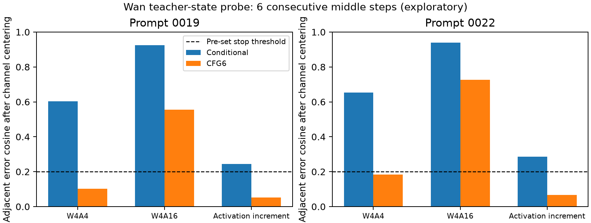

# 阶段报告 003：CFG对照否决了第一条方法路线

日期：2026-10-02。E002已完成：2个prompt×6个连续中期步骤×2个CFG分支，BF16回放与历史缓存逐元素一致；比较同输入的W4A4和仅禁用激活量化的W4A16。

## 结果

去掉逐通道空间时间均值后的相邻步误差cosine：

| 误差来源 | prompt0019 条件分支 / CFG6 | prompt0022 条件分支 / CFG6 |
|---|---:|---:|
| W4A4完整误差 | 0.603 / **0.102** | 0.654 / **0.184** |
| W4A16误差 | 0.926 / 0.555 | 0.939 / 0.727 |
| 激活量化增量（W4A4−W4A16） | 0.244 / 0.051 | 0.286 / 0.067 |

固定权重路径确有持久方向，但它在CFG6下的误差能量只相当于完整W4A4的17.6%/23.4%；激活量化增量对应94.5%/87.3%，另有负的交叉项，因此这些数值**不是可相加的独立方差占比**。

## 决策

按照E002预先设定的门槛：真正CFG输出的去bias相关在两个prompt都≤0.2，**停止“全W4A4误差强同向积累，因此做跨步互补”的方法路线**。不能只展示conditional漂亮相关、隐藏CFG结果，也不为挽救假设改阈值或扩大训练。

已知先例De-biasing Diffusion、TCEC、QuAKE进一步提高了创新门槛。本实验没有证明时间相关在所有模型无用；它仅否定在当前真实Wan设置中足以支持拟议路线的证据。

## 下一步

集中完成E003的H3模态选择性误差注入，测剩余49个BF16 block后的video/audio denoiser输出。若模态能量排序没有因果错配，也应结束这条解释；只有出现稳定且尚未被已有方法解释的差异，才进入方法设计。

边界：2个校准prompt、33帧、中期6步、teacher-state QDQ；没有自由rollout、原生FP4模型或视频质量结论。

原始结果：`../../results/research/E002_wan_temporal_errors.json`；汇总：`../06_experiments/results/E002_summary.json`；误差张量：`/data1/models/svdquant-wjq/research/20261002/E002/`。第一次启动的Ninja PATH错误日志保留，v2实际任务退出码0。
