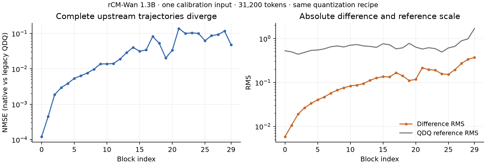

# 阶段报告 007：完整原生 Wan 基线与真实性能

2026-10-02。**300 个目标 linear 已实现原生 NVFP4；当前版本节省活跃张量显存，但尚未比 BF16 更快。** 这是部署基线，还不是论文贡献。

## 做了什么

将已有 rCM-Wan1.3B checkpoint 的300份 residual weights 原码打包，保持旧 smoothing、BF16低秩分支和attention。全部权重精确还原，完整30block旧路径回放逐元素相同。新增快速activation packer：10个真实/合成case的codes与scales逐字节一致，整模fast/slow native输出哈希也完全相同。

## 实际测量

同一RTX PRO5000 72GB、31,200视频tokens、480×832/77帧对应的**一次DiT调用**。三后端独立进程，同BF16 torch FLASH attention；各预热1次、重复3次，下表为包含检查的wall中位数。没有包含text encoder、VAE或模型加载。

| 后端 | 延迟（秒） | 峰值allocated（GiB） | 峰值reserved（GiB） | 常驻模型storage（GiB） |
|---|---:|---:|---:|---:|
| BF16 | 1.770 | 4.10 | 5.77 | 2.65 |
| 旧 QDQ + BF16 GEMM | 3.666 | 8.47 | 10.90 | 2.72 |
| 原生 NVFP4（当前未融合版本） | 1.975 | 3.01 | 7.01 | 0.86 |

原生相对旧QDQ快 **1.86×**，相对BF16却慢 **11.6%**。活跃张量峰值减少约26.5%，模型storage减少约67.5%；但allocator保留显存更高，不能把allocated下降直接当成进程实际占卡显存也同比下降。后续需比较现成融合实现；不把未融合低秩分支的开销说成NVFP4的固有限制。

独立trace定位：主干GEMM约312 ms→97 ms，但低秩分支253 ms、packing 89 ms、smoothing 69 ms抵消了节省；attention约841 ms，其余算子617 ms。低秩分支中约170 ms是逐元素乘法/加法，说明当前实现存在已知访存与融合缺口，而非新的量化机制。修正后的[互斥kernel汇总](../../results/research/E007_profile_summary.json)已剔除GPU annotation重复，kernel工作量不等同关键路径延迟。

## 数值观察与边界

相同码值单层原生/旧QDQ主支NMSE约5e-6–1.3e-5，完整一次DiT输出却相差 **4.28% NMSE**。两者各自对BF16的误差较接近，为16.40%和16.19%。下图同时展示绝对差异与参考幅度，避免把分母变化误作损伤增加。

这不是跨去噪步累积或感知质量结论，也尚未归因为某个scale/舍入机制。已有工程文档明确不保证fake/native逐位一致；本观察首先要求今后在真实部署路径上评价方法，不能据此声称新颖性。

## 后续

E008一个固定prompt的BF16/native四步独立采样与统一VAE解码已完成；BF16精确复现历史四步，两臂共享随机输入。接下来检查实际视频，再安排有限的更大模型/成熟融合baseline；暂不扩大benchmark或参数搜索。

证据：[完整正确性](../06_experiments/E007_wan_native_baseline_results.md)、[快速packing验证](../06_experiments/results/E007_fastpack_validation.json)、[性能协议](../06_experiments/E007_wan_native_profile_protocol.md)、[BF16结果](../../results/research/E007_profile_bf16.json)、[QDQ结果](../../results/research/E007_profile_qdq.json)、[native结果](../../results/research/E007_profile_native.json)、[配对视频计划](../06_experiments/E008_wan_native_paired_video_plan.md)。
