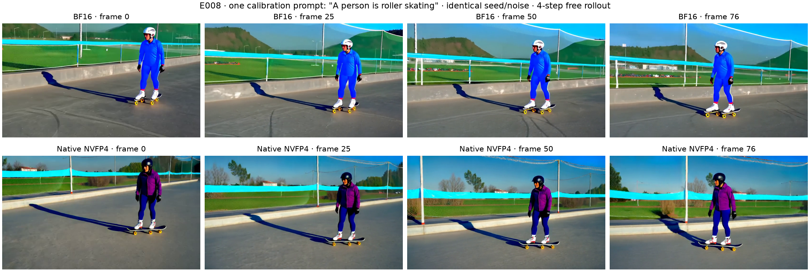

# 阶段报告 008：原生 NVFP4 配对视频已生成

2026-10-02。**已完成真实四步自由采样与视频解码；目前没有感知质量优劣结论。**

固定旧校准prompt0001“A person is roller skating”，77帧、480×832、16FPS。重新生成seed1后，BF16四步输入、timestep和预测全部与历史缓存逐元素相同；没有从BF16缓存反推高精度状态。BF16/native两臂共享初始FP64 latent及四个FP32噪声，各自递推自身预测。原生路径四步共1200次NVFP4 GEMM与1200份有效性检查全部通过。

两臂使用同一BF16 VAE完整空间解码；先释放DiT，再载入VAE。实验124.6秒，退出码0，GPU已释放。该时间包含加载、保存与检查，不能作视频生成速度benchmark。

- [BF16视频](/data1/models/svdquant-wjq/research/20261002/E008/p0001/bf16.mp4)
- [原生NVFP4视频](/data1/models/svdquant-wjq/research/20261002/E008/p0001/nativefast.mp4)

已查看第0/25/50/76帧：两边都呈现户外人物及轮滑装备，但衣服、头盔与背景明显不同。这支持“相同随机输入下采样内容会改变”，不能直接推出哪边质量更好，也不能通过静帧评价运动连续性。单个校准prompt不支持泛化结论；没有将latent误差当成视频质量指标。

当前整体结论仍是：基础运行与验证已补齐；原生Wan常驻模型storage降低，但现有未融合实现比BF16慢11.6%。算法筛选尚未得到足够的新颖且稳定的正结果。下一阶段先补更大目标模型与成熟融合路径的代表性基线，再决定哪些实际瓶颈值得研究；继续执行最近工作碰撞和小实验止损。

证据：[E008计划](../06_experiments/E008_wan_native_paired_video_plan.md)、[机器摘要](../06_experiments/results/E008_summary.json)、[完整原始记录](../../results/research/E008_wan_native_paired_video.json)、[007：完整原生性能](007_20261002_native_wan_baseline.md)。
